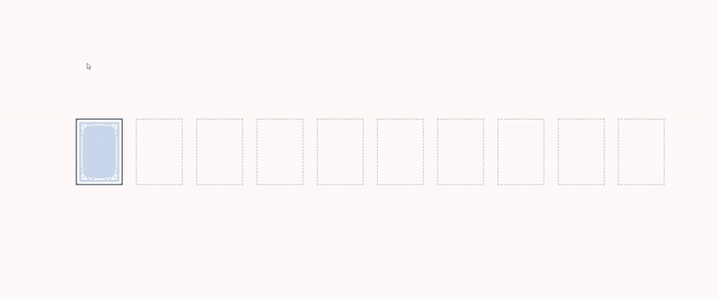

# Internet Technologies

Ресурс для сдачи работ: https://185.188.181.184:8181/

## lab1

**Задача №7:** Найдите в интернете изображения с игральными картами. Выберите одну любую масть и создайте страницу HTML со следующим функционалом. При старте страницы отображается колода карт, лежащих друг на друге рубашками вверх (все карты одной масти). При нажатии мышью на рубашке верхней карты карта «открывается» и откладывается вправо, уже рубашкой вниз. Нажав мышью 9 раз мы откроем всю колоду. Начальный порядок карт – случайный.

**Дедлайн:** 16 ноября

## lab2

**Задача №10:** ?

**Дедлайн:** ?
